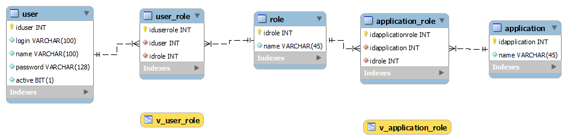
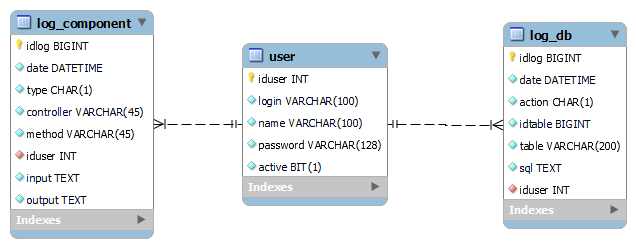

# Dal

- dev:   
- test:   
- main: 

Persistencia de las entidades necesarias para el sistema

Los diagramas de base de datos son los siguientes:

Diagrama entidad relación de administración

Diagrama entidad relación de autenticación

Diagrama entidad relación de configuración general

Diagrama entidad relación de contabilidad

Diagrama entidad relación de crm

Diagrama entidad relación de log

Diagrama entidad relación de notificación

## Guía de inicio

Estas instrucciones le darán una copia del proyecto funcionando en su máquina local con fines de desarrollo y prueba.
Consulte implementación para obtener notas sobre la implementación del proyecto en un sistema en vivo.

### Prerequisitos

Este proyecto está desarrollado en .net core 7, usando el ORM Dapper, el paquete de Entities y el conector a Mysql  
  
  
[Entities](https://github.com/Inglesefe/Entities/pkgs/nuget/Entities)  
[Mysql.Data](https://www.nuget.org/packages/MySql.Data)

## Pruebas

Para ejecutar las pruebas unitarias, es necesario tener instalado MySQL en el ambiente y ejecutar el script db-test.sql que se encuentra en el proyecto de pruebas.
La conexión se realiza con los datos del archivo appsettings.json del proyecto de pruebas, o con variables de entorno del equipo con los mismos nombres.

## Despliegue

El proyecto se despliega como un paquete NuGet en el repositorio [NuGet de GitHub](https://github.com/Inglesefe/Dal/pkgs/nuget/Dal)
